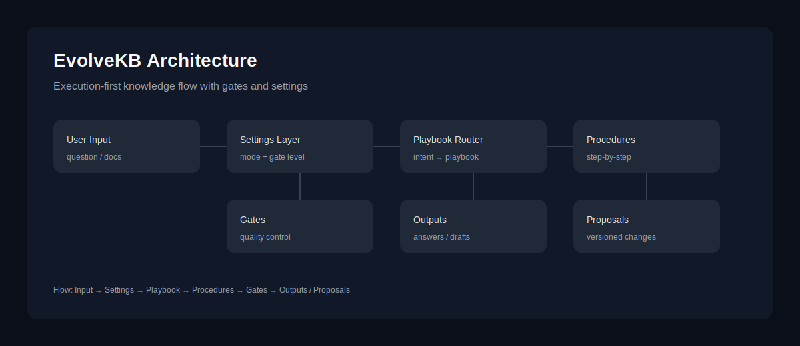

# EvolveKB — 执行优先的知识伴侣

[](./README.md)
[](https://github.com/2sao7sao/EvolveKB)
[](https://github.com/2sao7sao/EvolveKB/commits/main)
[](./LICENSE)

**语言：** [English](README.md) | 简体中文

> 把“知识”变成 **可执行的技能**。  
> 不只是存文档，而是让 AI 学会 **你的知识使用逻辑**，并在门控下持续演进。

---

## 快速导航

- [愿景](#愿景)
- [典型用例](#典型用例)
- [知识与用法](#知识与用法)
- [工作流程](#工作流程)
- [最小可运行 Demo](#最小可运行-demo)
- [知识摄取](#知识摄取)
- [模式预设](#模式预设)
- [用法复盘](#用法复盘每周)
- [路线图](#路线图)

---

## TL;DR

- 一个“外挂知识库”：重点是**知识使用逻辑**，而不是存储介质。
- 支持 **引用 / 消化 / 转化 / 演进** 四种用法，按你的习惯参与推理。
- 目标是让 AI **更懂你要什么知识、如何存、怎么用才有效**。

---

## 愿景

**Execution‑first**：先让知识可执行，再谈召回增强。  
我们希望 AI 不只是“找得到资料”，而是“知道如何组织与使用资料”。

当前状态：**Concept / WIP**（偏产品方向探索，尚未形成稳定可用的工程版本）。

---

## 为什么

传统 RAG 更擅长“找资料”，不擅长“让资料变成可复用流程”：

- **理解浅**：多是片段拼接，而非结构化理解与沉淀。
- **multi‑hop 易断链**：chunk 切分导致跨段逻辑断裂。
- **用法单一**：同一知识对不同用户/任务缺乏可配置的使用策略。

---

## 我们提供什么

**EvolveKB = 把知识升级为技能**：

- **Playbook**：面向一个 intent 的完整流程
- **Procedure**：可复用的原子能力
- **Settings**：控制知识如何参与推理与产出
- **Gate**：质量控制与演进门控

---

## 知识与用法

EvolveKB 将资产分为两类：

- **知识**：模型消化后的信息（是什么）
- **用法**：如何使用这些知识（怎么用）

目录结构：

```text
kb/
  knowledge/   # 结构化知识块
  usage/       # playbooks / procedures / strategies
```

Schema 与门控规则： [kb/SCHEMA.md](kb/SCHEMA.md)

## 典型用例

- **摒弃纯向量库路径**：不依赖“只做召回”，而是让知识可执行。
- **持续演进的知识更新**：在门控下沉淀更新，形成可回滚的版本演进。
- **更懂你的知识习惯**：通过交互学习你希望“如何存、怎么用、何时更新”。

---

## 工作流程

1. 用户提问 / 上传资料
2. 读取 settings：选择知识使用模式（reference / digest / transform / evolve）
3. 路由到对应 playbook
4. playbook 调用 procedures 分步执行
5. 每一步在 gate 下生成可验证中间产物
6. 若开启 evolve：提出变更 → gate 审核 → 合并为知识库新版本

---

## 架构示意



---

## 最小可运行 Demo

仓库内已经包含一条最小端到端路径（不依赖外部工具）：

```bash
python -m pip install -r requirements.txt
python scripts/run.py --intent compare_frameworks --question "对比 GraphRAG 和 Execution-first" --settings settings/reference.yaml
```

期望输出示例：[examples/demo.md](examples/demo.md)（reference / digest / transform / evolve）

---

## 知识摄取

直接从 Markdown 文档生成知识资产：

用法会在验证与使用中单独演进，存放在 `kb/usage`。

用法会在 playbook 执行后自动生成，并进行每周复盘。

```bash
python scripts/ingest.py --doc path/to/your.md
# -> kb/knowledge/<doc_name>.md
```

你也可以直接跑 playbook：

```bash
python scripts/run.py --intent ingest_doc --doc path/to/your.md --settings settings/transform.yaml
```

## 模式预设

通过 presets 切换不同知识行为。输出详细程度由 `output_template` 控制：

```bash
python scripts/run.py --intent compare_frameworks --question "..." --settings settings/reference.yaml
python scripts/run.py --intent compare_frameworks --question "..." --settings settings/digest.yaml
python scripts/run.py --intent compare_frameworks --question "..." --settings settings/transform.yaml
python scripts/run.py --intent compare_frameworks --question "..." --settings settings/evolve.yaml
```

---

## 模式对比


## 知识使用模式

| Mode | 作用 | 典型场景 |
| --- | --- | --- |
| Reference | 仅引用资料，不改写知识库 | 快速问答 / 保守模式 |
| Digest | 结构化摘要后再回答 | 需要吸收与总结 |
| Transform | 转为 procedures/playbooks | 构建可复用技能 |
| Evolve | 允许提出变更并门控合并 | 持续演进知识库 |

---

## 版本化提案

在 `evolve` 模式下，会写入一个可审阅的提案快照：

```bash
python scripts/run.py --intent compare_frameworks --question "..." --settings settings/evolve.yaml
# -> outputs/proposals/<timestamp>_compare_frameworks.md
```

---

## Gate 校验

使用 settings 触发门控规则校验：

```bash
python scripts/validate.py --settings settings/evolve.yaml
```

## 用法复盘（每周）

生成每周 usage 复盘报告与 TBD 清单：

```bash
python scripts/review_usage.py
# -> outputs/reviews/usage_review_<timestamp>.md
```

用法索引会自动维护在 `kb/usage/index.md`。用法事件存放在 `outputs/usage/events.log`。

## 路线图

1. ✅ README / 产品叙事定稿
2. ✅ 引入 settings 文件，用户可选知识使用模式
3. ✅ 最小可运行 demo（一条 end‑to‑end 路径）
4. ⏭️ 定义核心 skill schema 与 gate 规则
5. ⏭️ 引入“gate evolution loop”
6. ⏭️ 增加更多 playbook 与示例

---

## Star history


---

## Commit activity


---

## License

See `LICENSE`.
